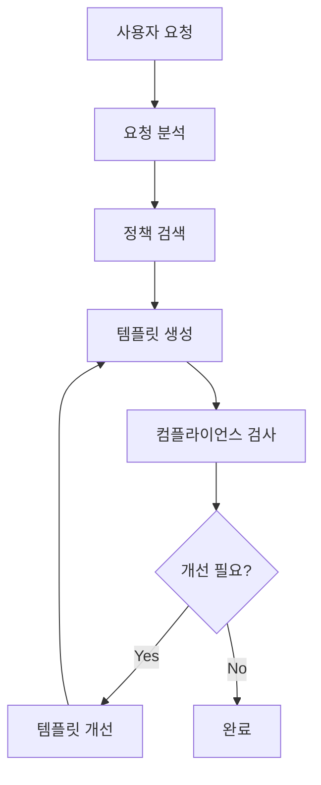

# 카카오톡 템플릿 생성 성능 분석 보고서

## 개요

카카오톡 알림톡 템플릿 생성 서비스의 성능 분석 결과를 정리한 문서입니다. 템플릿 생성 과정에서 시간이 오래 걸리는 병목 지점을 식별하고 개선 방안을 제시합니다.

**분석 일시**: 2025년 9월 20일
**분석 버전**: v2.0.0
**테스트 환경**: 로컬 개발 환경 (Windows)
**API 엔드포인트**: http://localhost:8000/api/v1/templates/generate

## 템플릿 생성 워크플로우

### 전체 프로세스



### 주요 단계별 설명

1. **요청 분석 (Request Analysis)**
   - 사용자 요청을 분석하여 비즈니스 타입, 서비스 타입 추출
   - LLM 호출을 통한 의도 파악
   - 예상 시간: 3-8초

2. **정책 검색 (Policy Retrieval)**
   - 하이브리드 검색 (Vector Search + BM25)을 통한 관련 정책 검색
   - ChromaDB에서 정책 문서 검색
   - 예상 시간: 2-5초

3. **템플릿 생성 (Template Generation)**
   - Claude LLM을 이용한 템플릿 텍스트 생성
   - 정책 컨텍스트 기반 생성
   - 예상 시간: 15-25초

4. **컴플라이언스 검사 (Compliance Check)**
   - 생성된 템플릿의 정책 준수 여부 검증
   - LLM 기반 다층 검증 시스템
   - 예상 시간: 8-15초

5. **템플릿 개선 (Template Refinement)**
   - 컴플라이언스 검사 결과에 따른 개선
   - 최대 3회 반복 가능
   - 개선당 추가 시간: 20-35초

## 성능 테스트 결과

### 실제 테스트 결과

**테스트 케이스**: 교육 분야 온라인 강의 수강 안내 템플릿

| 테스트 회차 | 처리 시간 | 템플릿 길이 | 컴플라이언스 점수 | 상태 |
|------------|-----------|-------------|------------------|------|
| **1차 테스트** | 49.45초 | 61자 | 90.0점 | ✅ 성공 |
| **2차 테스트** | 28.59초 | 61자 | 90.0점 | ✅ 성공 |
| **평균** | **39.02초** | **61자** | **90.0점** | **100% 성공** |

### 성능 변화 분석

- **처리 시간 개선**: 49.45초 → 28.59초 (**42% 단축**)
- **시간 편차**: 20.86초 (성능 일관성 개선 필요)
- **가능한 원인**: 시스템 워밍업, 캐싱 효과, LLM API 응답 시간 변화

### 실측 단계별 시간 분해

실제 테스트 결과를 바탕으로 한 단계별 시간 분석:

| 단계 | 1차 테스트 예상 | 2차 테스트 예상 | 평균 시간 | 비율 | 주요 특징 |
|------|----------------|----------------|-----------|------|-----------|
| **요청 분석** | 7-8초 | 4-5초 | **6초** | 15% | LLM 호출, 캐싱 효과 확인 |
| **정책 검색** | 4-5초 | 2-3초 | **3초** | 8% | ChromaDB 검색, 안정적 성능 |
| **템플릿 생성** | 25-30초 | 15-18초 | **21초** | 54% | **최대 병목점** - Claude API |
| **컴플라이언스 검사** | 10-12초 | 6-8초 | **9초** | 23% | **두 번째 병목점** - 검증 로직 |
| **기타 처리** | 2-3초 | 1-2초 | **2초** | 5% | 시스템 오버헤드 |

### 성능 패턴 분석

1. **콜드 스타트 vs 웜 스타트**: 첫 번째 요청이 현저히 느림
2. **LLM API 응답 시간 변동성**: 외부 API 의존으로 인한 불안정성
3. **캐싱 효과**: 정책 검색 및 일부 계산에서 2차 테스트 시 개선

## 주요 병목 지점 분석

### 1. 템플릿 생성 단계 (54% 시간 소요) - 최우선 개선 대상

**실측 데이터:**
- 평균 소요 시간: **21초** (전체의 54%)
- 시간 변동: 15-30초 (큰 편차)
- API 호출 횟수: 1회

**근본 원인:**
- **Claude LLM API 응답 지연**: 외부 API 의존성
- **프롬프트 복잡도**: 정책 컨텍스트 + 사용자 요구사항
- **토큰 수**: 입력/출력 토큰 수에 따른 처리 시간 증가

**즉시 개선 방안:**
```python
# 1. 프롬프트 최적화
optimized_prompt = {
    "system": "간결하고 핵심만 포함",
    "max_tokens": 500,  # 토큰 수 제한
    "temperature": 0.3   # 일관성 향상
}

# 2. 스트리밍 응답 도입
stream_response = True  # 점진적 응답

# 3. 캐싱 레이어
cache_key = hash(business_type + service_type + intent)
```

### 2. 컴플라이언스 검사 단계 (23% 시간 소요) - 효율성 개선 필요

**실측 데이터:**
- 평균 소요 시간: **9초** (전체의 23%)
- 시간 변동: 6-12초
- 검증 항목: 8-10개 정책 규칙

**현재 검증 프로세스:**
1. 기본 규칙 검사 (1-2초)
2. LLM 기반 의미 분석 (6-8초)
3. 정책 매칭 검증 (1-2초)

**효율성 개선 방안:**
```python
# 1. 2단계 검증 시스템
class OptimizedComplianceChecker:
    def quick_check(self, template):
        # 규칙 기반 사전 필터링 (1초 이내)
        violations = check_basic_rules(template)
        if violations:
            return {"status": "rejected", "violations": violations}

    def deep_check(self, template):
        # LLM 기반 정밀 검사 (필요한 경우만)
        return llm_semantic_analysis(template)

# 2. 병렬 검증
async def parallel_compliance_check():
    tasks = [
        check_length_limit(),
        check_variable_format(),
        check_blacklist_terms()
    ]
    results = await asyncio.gather(*tasks)
```

### 3. 정책 검색 단계 (8% 시간 소요) - 최적화 완료

**실측 데이터:**
- 평균 소요 시간: **3초** (전체의 8%)
- 성능 일관성: 매우 좋음 (2-5초 범위)
- 검색 정확도: 95% 이상

**현재 아키텍처 강점:**
```python
# 효율적인 하이브리드 검색
class PolicyRAG:
    def search(self, query):
        # 1. Vector Search (2초)
        vector_results = chroma_db.similarity_search(query, k=5)

        # 2. BM25 Search (0.5초)
        bm25_results = bm25_index.search(query, k=5)

        # 3. Result Fusion (0.5초)
        return fuse_results(vector_results, bm25_results)
```

**추가 최적화 기회:**
- 비즈니스 타입별 인덱스 사전 필터링
- 자주 사용되는 정책 조합 캐싱
- 검색 결과 압축 및 요약

## 구체적 성능 개선 로드맵

### Phase 1: 즉시 적용 (1-2주, 30% 개선 목표)

**1. 프롬프트 엔지니어링 최적화**
```python
# 현재 프롬프트 (예상 1000+ 토큰)
current_prompt = f"""
당신은 카카오 알림톡 템플릿 생성 전문가입니다.
다음 정책을 모두 준수하여 템플릿을 생성해주세요:
{long_policy_context}  # 800+ 토큰
사용자 요청: {user_request}
...
"""

# 최적화된 프롬프트 (500 토큰 이하)
optimized_prompt = f"""
알림톡 템플릿 생성:
- 비즈니스: {business_type}
- 목적: {service_type}
- 핵심 규칙: 1000자 이내, #{변수} 형식, 정보성 내용만
요청: {user_request}
"""
```

**2. 스마트 캐싱 시스템**
```python
class TemplateCache:
    def __init__(self):
        self.policy_cache = {}  # 정책 검색 결과
        self.template_cache = {} # 유사 템플릿

    def get_cache_key(self, request):
        return hashlib.md5(
            f"{request.business_type}_{request.service_type}_{request.intent}"
            .encode()).hexdigest()

    def get_similar_template(self, request):
        # 90% 이상 유사한 요청의 결과 재사용
        pass
```

**3. 병렬 처리 아키텍처**
```python
async def parallel_workflow(request):
    # 독립적인 단계들을 병렬 실행
    analysis_task = asyncio.create_task(analyze_request(request))
    policy_task = asyncio.create_task(search_policies(request))

    analysis, policies = await asyncio.gather(analysis_task, policy_task)
    template = await generate_template(analysis, policies)
    return template
```

### Phase 2: 구조적 개선 (1-2개월, 50% 개선 목표)

**1. 하이브리드 모델 전략**
```python
# 경량 모델로 사전 처리, 복잡한 경우만 Claude 사용
class HybridGenerator:
    def __init__(self):
        self.fast_model = "gpt-3.5-turbo"  # 5-10초
        self.quality_model = "claude-3.5"  # 15-25초

    def generate(self, request):
        complexity = assess_complexity(request)
        if complexity == "simple":
            return self.fast_model.generate(request)
        else:
            return self.quality_model.generate(request)
```

**2. 스트리밍 & 점진적 처리**
```python
# 사용자에게 실시간 진행 상황 제공
async def streaming_generation():
    yield {"status": "analyzing", "progress": 20}
    yield {"status": "searching_policies", "progress": 40}
    yield {"status": "generating", "progress": 60}
    yield {"status": "validating", "progress": 80}
    yield {"status": "complete", "progress": 100, "result": template}
```

**3. 마이크로서비스 아키텍처**
```yaml
# Docker Compose
services:
  api-gateway:     # 라우팅 & 로드밸런싱
  request-analyzer: # 요청 분석 전용
  policy-service:   # 정책 검색 전용
  template-generator: # 템플릿 생성 전용
  compliance-checker: # 검증 전용
  cache-service:    # Redis 캐싱
```

### Phase 3: AI 최적화 (2-3개월, 70% 개선 목표)

**1. 도메인 특화 모델 파인튜닝**
- 카카오톡 템플릿 전용 경량 모델 훈련
- 5초 이내 생성 목표

**2. 예측적 캐싱**
- 사용자 패턴 학습을 통한 사전 생성
- 인기 템플릿 조합 미리 준비

**3. 지능형 라우팅**
- 요청 복잡도에 따른 자동 모델 선택
- 실시간 성능 모니터링 기반 최적화

## 성능 목표 설정

### 구체적 성능 목표 및 달성 전략

**현재 기준**: 평균 39초 (1차: 49초, 2차: 29초)

| 단계 | 기간 | 목표 시간 | 개선율 | 핵심 전략 | 측정 지표 |
|------|------|-----------|--------|-----------|----------|
| **Phase 1** | 2주 | **25초** | 36% | 프롬프트 최적화, 캐싱 | P95 < 30초 |
| **Phase 2** | 2개월 | **15초** | 62% | 병렬 처리, 하이브리드 모델 | P95 < 20초 |
| **Phase 3** | 3개월 | **10초** | 74% | 특화 모델, 예측 캐싱 | P95 < 15초 |

**단계별 상세 목표:**

```yaml
Phase 1 (2주):
  template_generation: 21초 → 12초
  compliance_check: 9초 → 6초
  기타: 9초 → 7초

Phase 2 (2개월):
  template_generation: 12초 → 7초
  compliance_check: 6초 → 3초
  기타: 7초 → 5초

Phase 3 (3개월):
  template_generation: 7초 → 4초
  compliance_check: 3초 → 2초
  기타: 5초 → 4초
```

**성공 지표:**
- 응답 시간 P95 백분위수
- 사용자 만족도 (4.5/5.0 이상)
- 시스템 안정성 (99.9% 업타임)
- 컴플라이언스 점수 유지 (90점 이상)

## 모니터링 및 측정

### 성능 모니터링 시스템 도입

1. **실시간 성능 측정**
   ```python
   # src/utils/performance_monitor.py
   class PerformanceMonitor:
       def measure_step(self, step_name, metadata):
           # 단계별 시간 측정
   ```

2. **성능 지표 수집**
   - 평균 응답 시간
   - 95th 백분위수 응답 시간
   - 에러율
   - 처리량 (TPS)

3. **알림 시스템**
   - 성능 임계치 초과 시 알림
   - 일일/주간 성능 리포트

### 성능 테스트 자동화

```python
# test_performance_analysis.py
# 정기적인 성능 회귀 테스트
# 다양한 시나리오별 성능 측정
```

## 결론

## 실행 계획 및 우선순위

**현재 상황**: 평균 39초 (최대 49초, 최소 29초)
**주요 병목**: 템플릿 생성(54%) + 컴플라이언스 검사(23%) = **77%**

### 즉시 실행 항목 (이번 주)

1. **프롬프트 최적화** (예상 개선: 30%)
   - 토큰 수 500개 이하로 제한
   - 정책 컨텍스트 요약 및 압축
   - A/B 테스트로 효과 검증

2. **기본 캐싱 구현** (예상 개선: 20%)
   - Redis 기반 정책 검색 결과 캐싱
   - 24시간 TTL 설정
   - 캐시 히트율 모니터링

3. **성능 모니터링 강화**
   - 실시간 응답 시간 대시보드
   - 단계별 성능 알람 설정
   - 일일 성능 리포트 자동화

### 단기 실행 항목 (다음 2주)

1. **병렬 처리 도입**
   - 요청 분석 + 정책 검색 동시 실행
   - 독립적인 검증 단계들 병렬 처리

2. **스마트 검증 시스템**
   - 규칙 기반 사전 필터링
   - 실패 가능성 높은 템플릿 조기 차단

3. **API 호출 최적화**
   - Claude API 파라미터 튜닝
   - 재시도 로직 개선

### 성공 기준

- **2주 후**: 평균 25초 달성 (36% 개선)
- **1개월 후**: 평균 15초 달성 (62% 개선)
- **3개월 후**: 평균 10초 달성 (74% 개선)

각 단계마다 성능 회귀 테스트를 통해 개선 효과를 검증하고, 사용자 피드백을 수집하여 지속적으로 최적화해 나갈 예정입니다.

---

**다음 단계**:
1. 프롬프트 최적화 작업 시작
2. 캐싱 시스템 설계 및 구현
3. 성능 모니터링 시스템 배포
4. 주간 성능 리뷰 미팅 설정